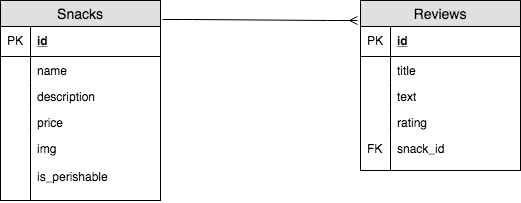

# gsnacks-api-Galvanize

*This is a recreation of Galvanize's gsnack backend from node, express to Go.*

## Database Structure



## Setup
1. Fork/ clone this repository 
2. open psql, createdb snacks_dev
3. go build 
4. go run main.go
5. Use postman to test routes 

## Routes

**GET /api/snacks**

**GET /api/snacks/featured**

**GET /api/snacks/:id**

**POST /api/snacks**
- required fields in body:
```
{
    name,           // STRING
    description,    // STRING
    price,          // INT
    img,            // STRING
    is_perishable   // BOOLEAN
}
```

**POST /api/snacks/:id/reviews**
- required fields in body:
```
{
    title,          // STRING
    text,           // STRING
    rating,         // INTEGER
}
```

**PATCH /api/snacks/:id**
- at least one(1) of the following fields in body is required:
```
{
    name,           // STRING
    description,    // STRING
    price,          // INT
    img,            // STRING
    is_perishable   // BOOLEAN
}
```

**PATCH /api/snacks/:id/reviews/:id**
- at least one(1) of the following fields in body is required:
```
{
    title,          // STRING
    text,           // STRING
    rating,         // INTEGER
}
```

**DELETE /api/snacks/:id**

**DELETE /api/snacks/:id/reviews/:id**
